<div align="center">
    <h2>crawLdb - 豆瓣数据爬虫和数据文本分析平台</h2>
    
    <div align="center">
    </div> 
</div>


> 目前仅针对豆瓣平台进行分析，后续会加入对哔哩哔哩平台分析功能
>
> 建议某些老师眼睛擦亮点，嘴上说严打项目抄袭的人，背地里做着又是另一套，多善用下Git吧😅

#### 功能

- 实时爬取豆瓣网站电影评论、电影详情信息
- 自动化对电影评论+详情进行主题建模和情感分析
- 对电影评论+电影详情进行信息管理等等
- 对用户信息进行增删改查等等
- 自定义代理池爬取
- 对日志信息进行增删改查等等
- 2FA登录认证

> 因为数据量太大（有100w+的评论数据和2k部电影信息），所以数据库就不放在Git上了，有需要的可以自己重新爬取下

#### 技术栈

##### 前端

- React
- Ant Design全家桶
- L7Plot 地理空间可视化图表库

设计语言：TypeScript (EX: JavaScript)

测试框架：Mock.js

##### 后端

- PyOTP (Google Authentication)
- Django Rest Framework (DRF)
  
- 数据库：MySQL
- 数据缓存：Redis

#### 项目截图

##### 首页

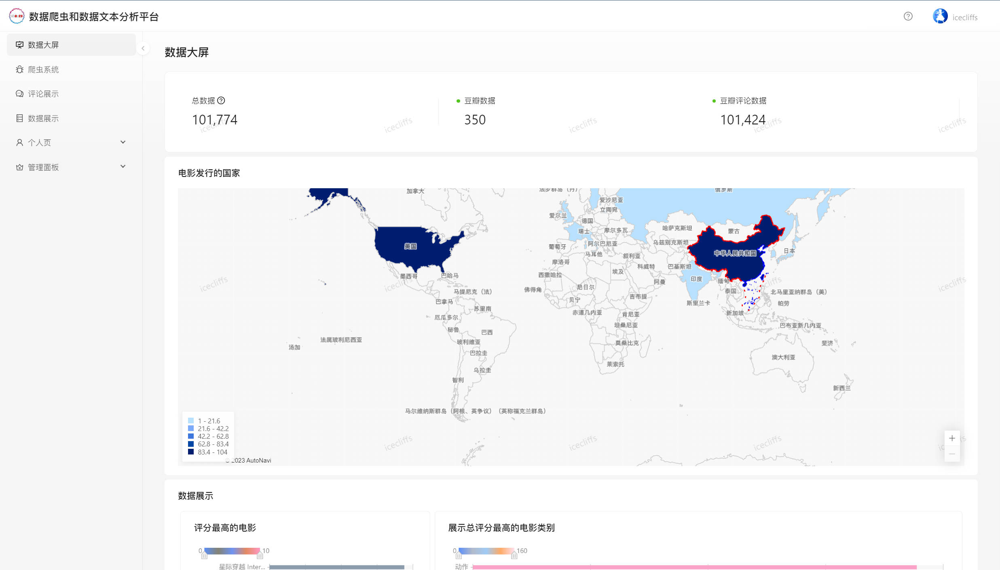

##### 登录页面


##### 登陆页面（2FA）

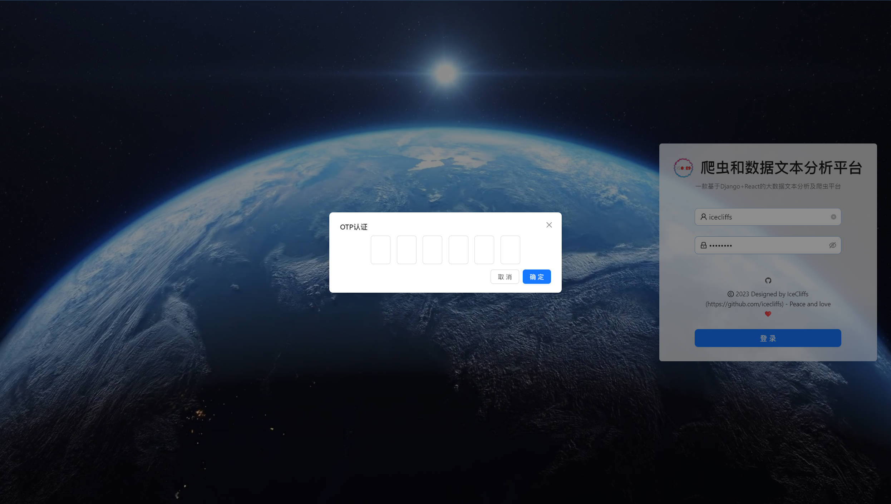

##### 爬虫页面

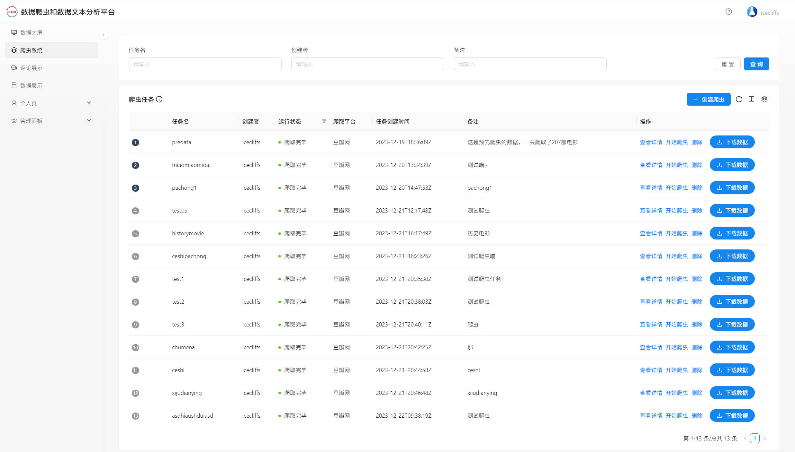

##### 爬虫页面（新建任务）

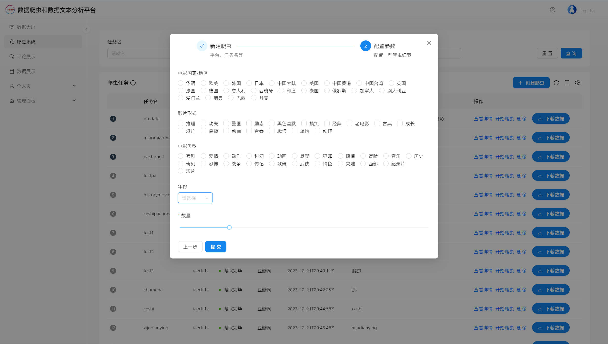

##### 爬虫页面（新建任务）

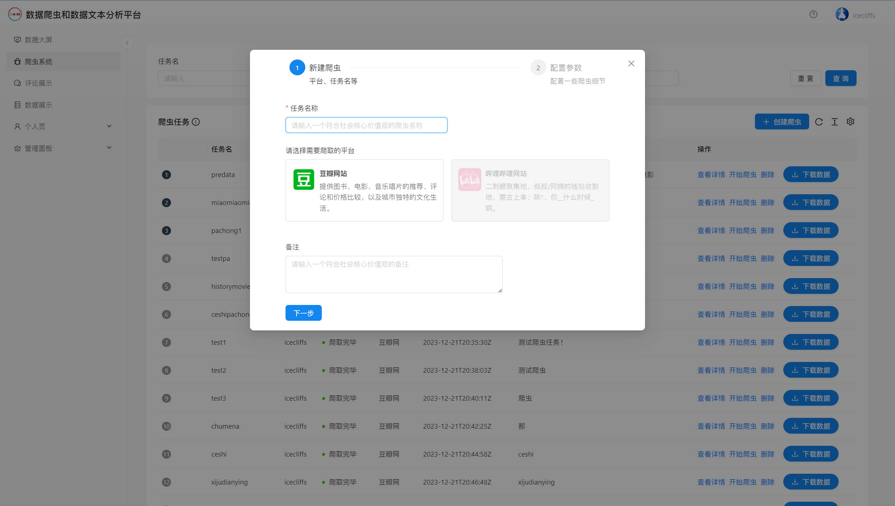

##### 爬虫页面（任务爬取状态）

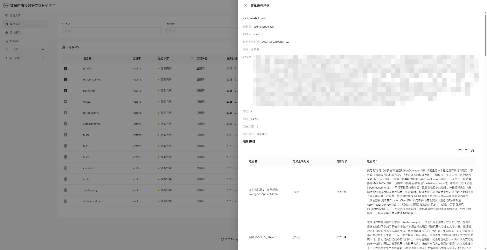

##### 评论页面

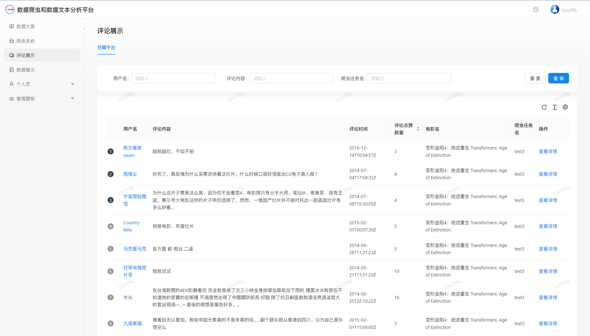

##### 情感分析页面

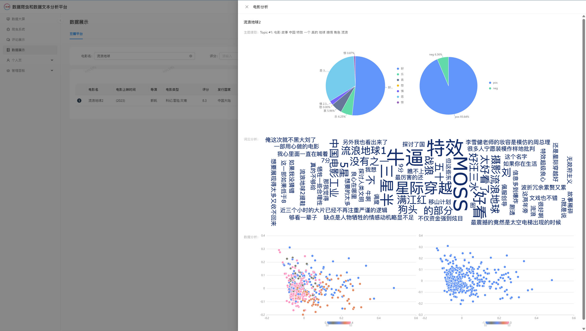

##### 用户管理页面

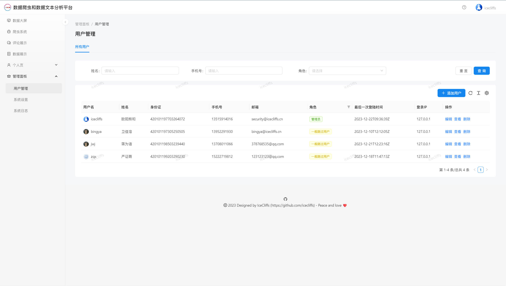

##### 用户管理页面（用户新增）

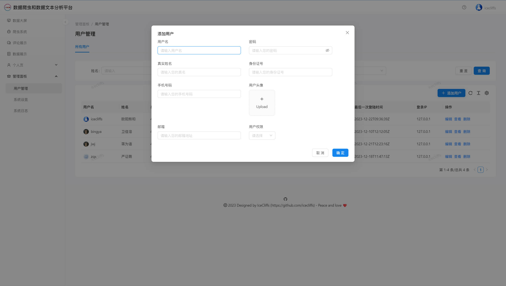

##### 用户管理页面（用户详情）

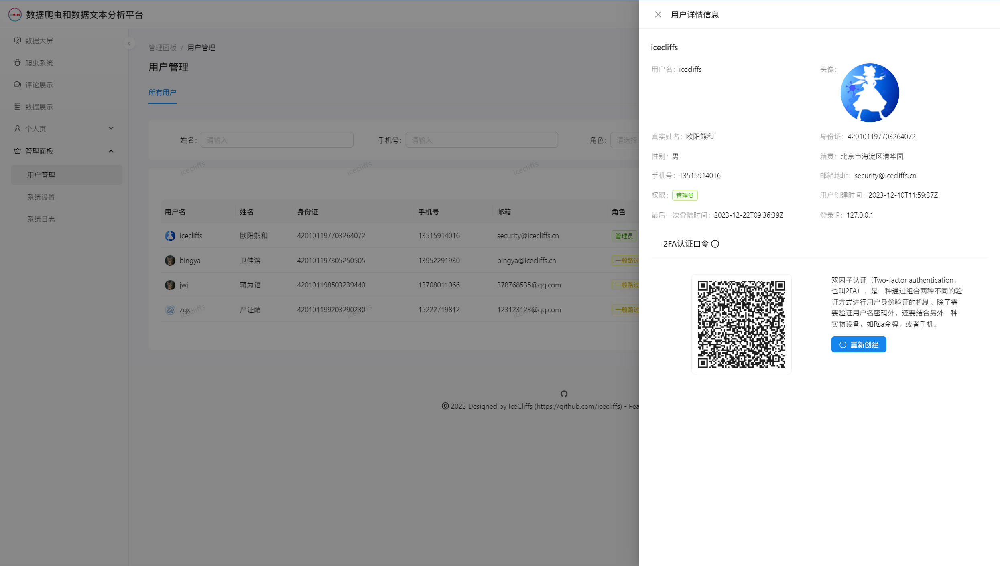

##### 系统管理页面

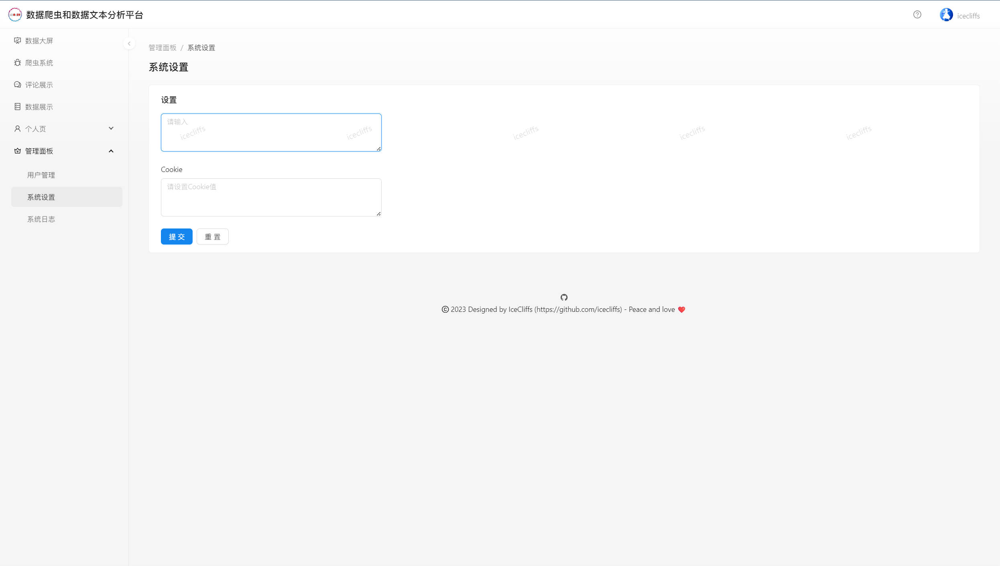

##### 系统日志页面

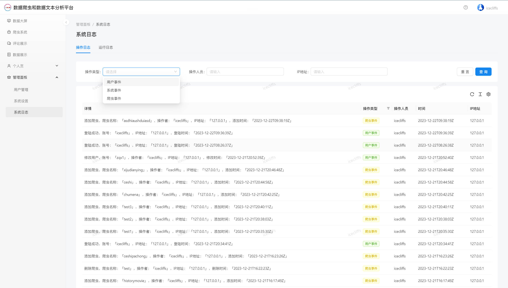

#### 版权许可说明

```
GNU GENERAL PUBLIC LICENSE
Version 3, 29 June 2007

Copyright (C) 2007 Free Software Foundation, Inc. <https://fsf.org/>
Everyone is permitted to copy and distribute verbatim copies
of this license document, but changing it is not allowed.
```
